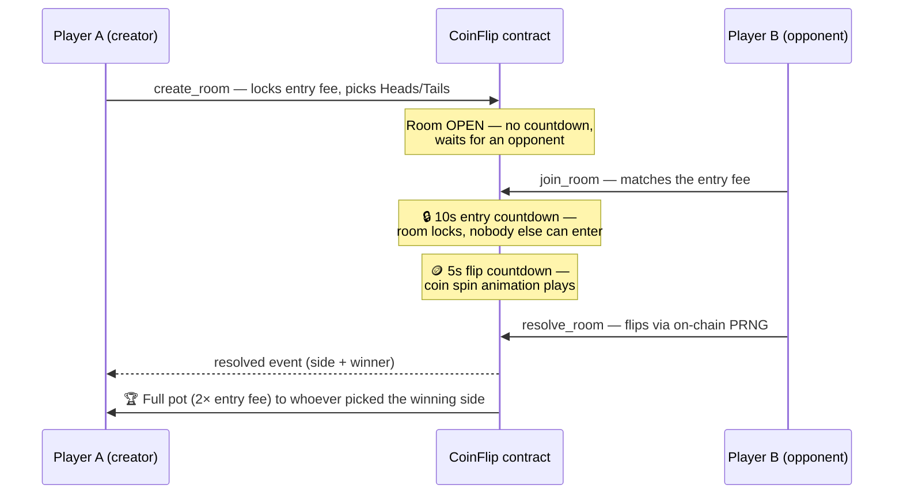

# 🪙 Stellar CoinFlip

A **peer-to-peer coin flip game** on the Stellar network, powered by a custom
**Soroban smart contract** on Testnet.

Create a room, lock your entry fee, and pick **heads or tails**. The room waits
for an opponent — **no countdown while it's open**. The moment someone joins by
matching your fee, a **10-second entry countdown** starts and the room locks.
**5 seconds later** the coin is flipped on-chain using protocol randomness, and
the contract instantly pays the **entire pot to the winner**.

> **Deployed contract (Testnet):** [`CDEY63H77ICFIGDFOIVGKSI7LNAQP4PBRFXJBOKLMH4RJFIC55TVCYRJ`](https://stellar.expert/explorer/testnet/contract/CDEY63H77ICFIGDFOIVGKSI7LNAQP4PBRFXJBOKLMH4RJFIC55TVCYRJ)
>
> **Deploy transaction:** [`0bae057d60ab0721037271fcc567aabc067366407313f5bace5e77acb19d62cf`](https://stellar.expert/explorer/testnet/tx/0bae057d60ab0721037271fcc567aabc067366407313f5bace5e77acb19d62cf)

> **Demo Video on Youtube:** [`https://www.youtube.com/watch?v=QHGW5WzR_-Y`](https://www.youtube.com/watch?v=QHGW5WzR_-Y)

---

## 🎮 How a game plays out



Each room has its own page (`/room/[id]`) where the whole match plays out live:
the join, the countdowns, the 3D coin-flip animation, and the winner reveal
showing which side came up and who takes the pot.

## ✨ Features

- **Multi-wallet support** via [StellarWalletsKit](https://stellarwalletskit.dev)
  (Freighter, xBull, Albedo, Lobstr, Hana, Rabet, HOT, WalletConnect, …) with a
  built-in wallet-selection modal, session restore, and graceful handling of
  *wallet not found*, *user rejected*, and *insufficient balance* errors.
- **Custom Soroban contract** with real business logic: escrowed entry fees,
  join-triggered 10s + 5s countdowns, an on-chain PRNG coin flip, instant
  winner payout, and creator refunds for unmatched rooms.
- **Live game rooms** — every room is a dedicated route with real-time state:
  waiting → entry lock countdown → coin-flip animation → animated result
  reveal, with auto-triggered on-chain resolution.
- **Real-time updates** — rooms, balances, and events are polled with TanStack
  Query, so the whole UI updates automatically without refreshing.
- **Event feed** — every activity entry originates from an on-chain contract
  event (`created`, `joined`, `resolved`, `cancelled`) fetched via Soroban RPC
  `getEvents`: event type, timestamp, wallet address, and action.
- **Transaction tracking** — locally persisted history with live
  *pending / success / failed* status, transaction hashes, and
  [stellar.expert](https://stellar.expert) explorer links.
- **Polished UI** — responsive, dark mode, toast notifications, skeleton
  loaders, and empty/error states built on shadcn/ui.

## 🧠 Game rules

1. **Create a room** — pick *heads* or *tails* and lock an entry fee. The room
   stays open, waiting for an opponent. **No countdown starts yet.**
2. **Opponent joins → countdown starts** — anyone can join anytime by matching
   the fee (they implicitly take the opposite side). Their join starts the
   **10-second entry countdown**, after which the room is locked.
3. **5-second flip** — the coin-spin animation plays; then the result is
   revealed on-chain via `resolve_room` (auto-triggered from the room page —
   anyone may submit it).
4. **Winner takes all** — if **heads** comes up, whoever chose heads gets the
   full pot (2× entry fee); if **tails**, the tails picker wins. The contract
   pays out instantly and emits a `resolved` event.
5. **Changed your mind?** — while the room is still open (no opponent), the
   creator can cancel anytime for a full refund.

> ⚠️ The flip uses Soroban's protocol PRNG (`env.prng()`), which is fine for a
> demo game. High-stakes production games should use commit–reveal or an
> external randomness beacon.

## 🛠 Tech stack

| Layer          | Tech                                              |
| -------------- | ------------------------------------------------- |
| Runtime / PM   | Bun (package manager & script runner)             |
| Frontend       | Next.js 15 (App Router), TypeScript, Tailwind CSS |
| UI components  | shadcn/ui (Radix primitives), lucide-react, sonner|
| Wallets        | `@creit.tech/stellar-wallets-kit`                 |
| Blockchain     | `@stellar/stellar-sdk` (Soroban RPC + Horizon)    |
| Data fetching  | TanStack Query (polling for real-time updates)    |
| State          | Zustand (wallet session + persisted tx history)   |
| Smart contract | Rust + `soroban-sdk` 22                           |

## 📁 Project structure

```
coin-flip/
├── client/                 # Next.js 15 frontend (Bun)
│   ├── app/
│   │   ├── page.tsx        # Home — hero, how it works, live activity
│   │   ├── play/           # Game lobby: room list + create room
│   │   ├── room/[id]/      # Live game room: countdowns, flip animation, result
│   │   ├── dashboard/      # Wallet dashboard: address, balances, network
│   │   ├── activity/       # On-chain contract event feed
│   │   └── transactions/   # Local transaction history
│   ├── components/
│   │   ├── ui/             # shadcn/ui primitives
│   │   ├── layout/         # Navbar, theme toggle
│   │   ├── wallet/         # Connect button, wallet dashboard
│   │   ├── game/           # Room view, room cards, create dialog, 3D coin
│   │   ├── activity/       # Event feed
│   │   ├── transactions/   # Tx history + status badges
│   │   └── shared/         # Empty/error states, config banner
│   ├── hooks/              # useWallet, useRooms, useGameEvents, useGameActions…
│   ├── lib/                # config, stellar (RPC/Horizon), wallet-kit,
│   │                       # contract client, error mapping, game helpers
│   ├── stores/             # Zustand stores (wallet, transactions)
│   ├── types/              # Shared TypeScript types
│   └── public/
├── contract/               # Soroban smart contract (Rust)
│   ├── Cargo.toml
│   └── src/                # lib.rs + test.rs (11 unit tests)
├── script/                 # deploy.sh / deploy.ps1
└── README.md
```

## 🚀 Setup

### Prerequisites

- **Bun 1.1+** — install from [bun.sh](https://bun.sh):
  ```powershell
  # Windows
  powershell -c "irm bun.sh/install.ps1 | iex"
  # macOS / Linux
  curl -fsSL https://bun.sh/install | bash
  ```
- **Rust** (`rustup`) with the wasm target: `rustup target add wasm32v1-none`
- **Stellar CLI**: `cargo install --locked stellar-cli`
- A Stellar wallet browser extension (e.g. [Freighter](https://freighter.app))

> This project uses **Bun exclusively** as its package manager and script
> runner — no npm/pnpm/yarn. The lockfile is `bun.lock`.

### 1. Install dependencies

```bash
cd client
bun install
```

### 2. Configure environment

```bash
# inside client/
cp .env.example .env.local
```

| Variable                               | Description                                 |
| -------------------------------------- | ------------------------------------------- |
| `NEXT_PUBLIC_COINFLIP_CONTRACT_ID`     | Deployed contract ID (set by deploy script) |
| `NEXT_PUBLIC_STELLAR_NETWORK`          | `TESTNET` (default) or `PUBLIC`             |
| `NEXT_PUBLIC_SOROBAN_RPC_URL`          | Soroban RPC endpoint                        |
| `NEXT_PUBLIC_HORIZON_URL`              | Horizon endpoint (balances)                 |
| `NEXT_PUBLIC_NATIVE_TOKEN_CONTRACT_ID` | Native XLM SAC address on testnet           |
| `NEXT_PUBLIC_EXPLORER_URL`             | Block explorer base URL                     |

### 3. Deploy the contract to Testnet

```bash
# from the repo root
# macOS / Linux / WSL / Git Bash
bash script/deploy.sh

# Windows PowerShell
powershell -ExecutionPolicy Bypass -File script/deploy.ps1
```

The script:
1. Generates + funds a deployer identity via Friendbot
2. Builds the contract (`stellar contract build`)
3. Runs the contract test suite
4. Deploys with the native XLM SAC as the constructor argument
5. Writes the contract ID into `client/.env.local` automatically

### 4. Wallet setup

1. Install [Freighter](https://freighter.app) (or any supported wallet).
2. Switch the wallet to **Testnet**.
3. Fund your account with [Friendbot](https://friendbot.stellar.org) — the
   Dashboard page has a one-click funding button for unfunded accounts.

> To play against yourself locally, use two browsers (or a normal + incognito
> window) with two different funded testnet wallets.

### 5. Local development

```bash
cd client
bun run dev
# open http://localhost:3000
```

Useful scripts (run inside `client/`):

```bash
bun run contract:build   # build the contract wasm
bun run contract:test    # run the Rust contract tests
bun run contract:deploy  # deploy to testnet
bun run build            # production build
bun run start            # serve the production build
```

## ☁️ Vercel deployment

1. Push the repo to GitHub (make sure `bun.lock` is committed — Vercel
   auto-detects Bun from it and uses `bun install` as the install command).
2. Import the project in [Vercel](https://vercel.com/new).
3. Set the project **Root Directory** to `client/`.
4. Add the environment variables from `client/.env.local` in
   **Project Settings → Environment Variables** (all `NEXT_PUBLIC_*`).
5. Deploy — the frontend is fully static/client-side and needs no server keys.

## 📜 Smart contract API

| Function                                | Description                                      |
| --------------------------------------- | ------------------------------------------------ |
| `__constructor(token)`                  | Sets the SAC used for entry fees                 |
| `create_room(creator, entry_fee, side)` | Locks fee, opens a room (no countdown yet)       |
| `join_room(room_id, opponent)`          | Matches the fee — starts the 10s + 5s countdown  |
| `resolve_room(room_id)`                 | After the countdown: flips via PRNG, pays winner |
| `cancel_room(room_id, caller)`          | Creator refund while the room is still unmatched |
| `get_room / get_rooms / get_room_count` | Read-only room queries                           |

Events emitted: `created`, `joined`, `resolved`, `cancelled` — all consumed by
the frontend activity feed.

## 🔧 Troubleshooting

**"Bad union switch: 4" while confirming a transaction**
Stellar testnet runs protocol 23+, whose transaction metadata
(`TransactionMetaV4`) older SDK versions can't decode. The app already works
around this by polling transaction status via raw JSON-RPC and parsing only
the standalone return value — if you fork this project and see the error, don't
downgrade the workaround in `client/lib/stellar.ts`.

**Windows without Visual Studio Build Tools**
The MSVC linker is required by the default Rust toolchain. Either install VS
Build Tools, or use the GNU toolchain, which ships its own linker:

```powershell
rustup toolchain install stable-x86_64-pc-windows-gnu --profile minimal
rustup target add wasm32v1-none --toolchain stable-x86_64-pc-windows-gnu
cd contract
cargo +stable-x86_64-pc-windows-gnu build --target wasm32v1-none --release
stellar contract deploy --wasm target/wasm32v1-none/release/coinflip.wasm --source coinflip-deployer --network testnet -- --token CDLZFC3SYJYDZT7K67VZ75HPJVIEUVNIXF47ZG2FB2RMQQVU2HHGCYSC
```

**Room list is empty / "Contract not configured" banner**
Set `NEXT_PUBLIC_COINFLIP_CONTRACT_ID` in `client/.env.local` (the deploy
script does this automatically) and restart the dev server.

## 🗺 Git plan

| Phase | Commit                                  |
| ----- | --------------------------------------- |
| 1     | Project setup & wallet integration      |
| 2     | Smart contract & frontend integration   |
| 3     | Real-time events & transaction tracking |
| 4     | UI polish & documentation               |

## 📄 License

MIT — for educational/demo purposes on Stellar Testnet.
